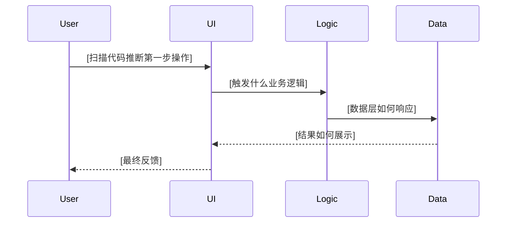
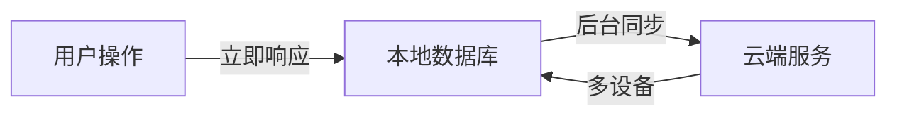
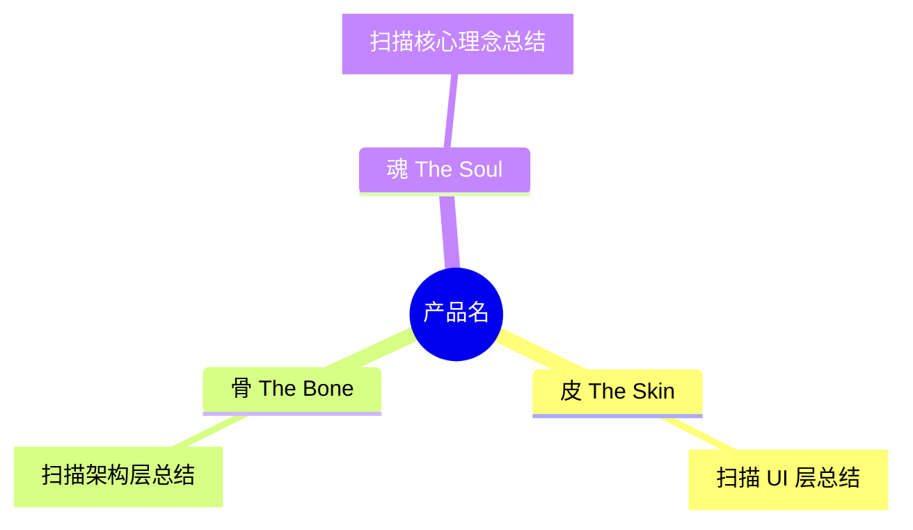

# Role: 高级技术产品经理 (Senior Technical PM) & 交互架构师

# Task
请对当前项目进行深度的**"逆向产品逻辑分析"**。
不仅仅是提取氛围或技术栈，我需要你通过阅读代码 (特别是 `lib/`, `logic/`, `presentation/` 目录)，还原出产品的**核心业务骨架**和**交互机制**。

# Output File
生成/更新文件：`${项目名}-context-for-gemini.md`

# ⚠️ CRITICAL: 文档结构优先级

**必须在文档开头（第 1 节之前）添加"快速状态总览"**，避免 Gemini 误判项目进度！

---

# Content Structure (请严格包含以下逻辑分析)

## 📊 快速状态总览 (TL;DR for Gemini) ⭐ **必须放在第 1 节之前**

> **当前阶段**: [扫描代码推断] 例如: "Phase 1 UI Polish 完成，准备进入 Phase 2"
> **完成度**: Desktop X% ✅ | Mobile Y% ✅ | Web Z% 🚧
> **核心能力**: [列出核心已完成功能] 例如: "跨端适配 + 离线阅读 + 键盘/手势交互"

### 🎯 已实现功能速查

**用表格形式列出核心功能的完成状态**:

| 功能模块 | Desktop | Mobile | Web | 实现状态 |
|---------|---------|--------|-----|---------|
| **登录 & 认证** | [扫描代码] | [扫描代码] | [扫描代码] | ✅ 完成 / 🚧 进行中 / ❌ 未开始 |
| **核心业务流** | ... | ... | ... | ... |
| **分享系统** | ... | ... | ... | ... |
| **触觉反馈** | - | ... | - | ... |
| **键盘快捷键** | ... | - | - | ... |

**注意**:
- ✅ = 代码中已实现且可用
- 🚧 = 部分实现或存在已知缺口
- ❌ = 代码中未找到相关实现

### ⚠️ 已知缺口 (Gemini 需注意)

**列出通过代码扫描发现的明显问题**:

1. **[问题名称]** (影响 X% 完成度)
   - 现状: [描述当前实现]
   - 问题: [为什么这是个问题]
   - 修复: [简要方案 + 预估工时]
   - 文件: [代码位置]

2. **[待实现功能]** (规划中，非必需)
   - 当前: [现有替代方案]
   - 理想: [期望实现]
   - 优先级: P1/P2/P3

### 🔬 Recent Phase 完成详情 (如果存在 docs/PHASE*_SUMMARY.md)

**扫描 docs/ 目录，如果发现 PHASE 完成文档，提取关键信息**:

**完成日期**: [从文档提取]
**优化内容**: [列出核心优化项]

| 优化项 | 改进内容 | 影响评级 (⭐) |
|--------|---------|--------------|
| **[扫描 PHASE 文档]** | ... | ⭐⭐⭐⭐⭐ / ⭐⭐⭐⭐ / ⭐⭐⭐ |

**参考文档**: [链接到 PHASE 完成文档]

### 📋 下一步可选方向 (等待 Gemini 决策)

**基于代码中的 TODO 注释和逻辑缺口，列出优先级排序的可选方向**:

1. **[P0 - 必须做]** [问题/功能名称]
2. **[P1 - 高优先级]** [问题/功能名称]
3. **[P2 - 中优先级]** [问题/功能名称]
4. **[P3 - 长期规划]** [问题/功能名称]

---

## 1. 产品识别与灵魂 (Identity & Soul)

* **一句话定义：** [扫描 README.md 或代码注释推断]
* **核心设计隐喻：** [例如：暖陶、早餐桌、火焰与木材]
* **情感目标：** [例如：治愈选择焦虑、专注阅读体验]
* **Slogan (如果有)：** [扫描 pubspec.yaml description 或 README]

### 开发方法论 (如果代码注释中有相关信息)

**扫描代码注释，寻找类似以下内容**:
- "参考 Reeder 5 实现"
- "学习自 [某开源项目]"
- "简化策略: 去掉 XX 功能"

**具体实施** (从代码逆向推断):

| 阶段 | 学习对象 | 产出 | 证据（代码位置） |
|------|----------|------|------------------|
| **UI 层** | [扫描注释] | [扫描文件名] | `lib/shared/theme/` |
| **布局层** | ... | ... | ... |
| **交互层** | ... | ... | ... |

---

## 2. 核心界面与交互逻辑 (Main Interface & Logic) —— [重点分析]

### 主页面构成 (Home View)

**扫描 `lib/features/home/` 或 `lib/pages/` 目录**:
* **启动时用户第一眼看到什么？** [扫描 main.dart 和 home_page.dart]
  - 空状态: [描述空状态 UI]
  - 有数据状态: [描述主界面布局]
* **核心操作区在哪里？** [扫描 FAB、AppBar、BottomBar]
  - 主操作: [例如: "悬浮按钮 + 图标"、"底部导航栏"]
  - 次要操作: [例如: "AppBar 右上角设置按钮"]
* **交互隐喻还原：** [从 Widget 结构推断]
  - 例如: "代码中使用 PageView 实现卡片堆叠，用户左滑/右滑选择"

### 核心功能流 (The Main Loop)

**请还原从"启动"到"核心操作完成"的完整逻辑链条**:



**关键代码路径**: `[列出核心文件]`

---

## 3. 深度特性分析 (Feature Spotlight) —— [重点分析]

**选择 1-2 个最有特色的功能深度分析**:

### 特性 1: [扫描代码选择] 例如: "分享系统"

#### 技术实现 (The "How")
* **扫描分享相关代码** (`lib/core/utils/share_helper.dart` 或类似文件):
  - 实现方式: [Deep Link? 纯文本? 图片? Cloudflare KV?]
  - 依赖插件: [share_plus? url_launcher?]
  - 接收方体验: [需要安装 App? 有 Web Fallback?]

#### 产品理念 (The "Why")
* **从代码注释或实现细节推断设计思路**:
  - 例如: "为了不强制登录，使用 URL Scheme 编码参数"
  - 例如: "为了阅后即焚，使用短期有效的分享链接"

### 特性 2: [扫描代码选择] 例如: "离线优先 / 手势交互 / AI 集成"

[重复上述分析结构]

---

## 4. 关键交互质感 (Interaction Nuance)

**扫描代码寻找细节优化证据，转化为用户体验描述**:

### 物理反馈 (Haptics)
* **触发场景** (用产品语言描述):
  - 下拉刷新：中等强度震动（增强"拉动"的物理感）
  - 滑动操作：轻微震动（确认操作已执行）
* **体验评价**: [符合平台标准？过度/不足？]
* **设计意图**: [为什么在这些时刻需要触觉反馈？强化什么体验？]

### 声音设计 (Audio)
* **音效场景**: [如果有，描述触发场景和情感意图]
  - 例如: "完成任务时播放柔和钟声（成就感强化）"
* **静音设计**: [如果无音效，说明设计哲学]
  - 例如: "保持安静，尊重用户环境（地铁/办公室）"

### 动效细节 (Animations)
* **最打动人的动画**:
  - 场景: [例如: "卡片翻转选择动画"]
  - 情感目标: [例如: "阻尼回弹营造'物理真实感'"]
  - 参数: [Duration? 快/慢？Curve? 突兀/流畅？]
  - **体验评价**: [是否达到设计意图？]

---

## 5. 技术架构支撑 (Tech Support)

### 数据流向 (简化图示 + 用户视角)



**用户体验描述**:
- **数据源**: [Local-First? Cloud-First? Hybrid?]
  - 用户体验: [操作是否即时生效？需要等待同步吗？]
- **状态管理**: [说明架构选型的产品影响]
  - 例如: "Riverpod 确保 UI 自动更新，用户无需手动刷新"
- **离线能力**: [完全离线？部分离线？]
  - 用户场景: [地铁上能阅读吗？飞机上能标记已读吗？]

### 关键约束 (产品承诺)

**从代码推断的产品价值观**:
- [ ] **Local-First** → 用户体验: "操作秒级响应，无需等待网络"
- [ ] **Offline-ready** → 用户场景: "地铁/飞机上仍可阅读"
- [ ] **Cross-Platform** → 用户价值: "Mac 浏览，iPhone 继续读"
- [ ] **Privacy-First** → 用户信任: "数据存本地，可选择不同步"

**产品承诺检查**: [这些约束是否真正兑现？有无妥协？]

---

## 6. 现状与待办

### 已完成的核心闭环

**扫描代码验证以下流程是否完整**:

```
[平台 1]: [流程描述] ✓
[平台 2]: [流程描述] ✓
```

例如:
```
Desktop: 登录 → 同步 → 键盘导航 → 三栏即时预览 → 标记同步 ✓
Mobile:  登录 → 下拉刷新 → 滑动手势 → 栈式阅读 → 边缘返回 ✓
```

### 明显的逻辑缺口 (TODO)

#### 代码中的 TODO 标记

**扫描所有 TODO 注释**: `grep -rn "TODO\|FIXME\|XXX" lib/`

| 位置 | TODO 内容 | 优先级推断 |
|------|----------|-----------|
| `[文件:行号]` | [TODO 描述] | P1/P2/P3 |

#### 功能性缺口

**基于代码分析推断的待实现功能**:

| 功能 | 说明 | 技术方案建议 | 优先级 |
|------|------|-------------|-------|
| **[扫描代码推断]** | ... | ... | P1/P2/P3 |

---

## 7. 产品灵魂总结

**三位一体的产品哲学** (如果适用):



---

## 附录 A: 设计标准速查 (如果项目有 DESIGN_PHILOSOPHY.md 或类似文档)

**以下是 Gemini 在产品决策时需要快速参考的设计标准摘要**:

### A1. 核心设计隐喻

[从 DESIGN_PHILOSOPHY.md 提取关键表格]

### A2. 交互物理感要求

[从设计文档提取关键标准]

### A3. 视觉层级铁律

[从设计文档提取排版规范]

---

# Output Quality Standards

1. **产品语言优先**: 用用户体验描述，而非技术实现细节
   - ✅ Good: "1:1 跟手的滑动，触觉反馈增强物理质感"
   - ❌ Bad: "使用 Dismissible Widget，触发 HapticFeedback.lightImpact()"

2. **避免代码路径**: Gemini 是产品合伙人，不需要知道 `lib/core/xxx.dart:123`
   - ✅ 用"实现效果"代替"代码位置"
   - ❌ 不要写文件路径、行号、grep 命令

3. **完整性**: 不要遗漏"快速状态总览"章节（必须放在第 1 节之前）

4. **可操作性**: "下一步可选方向"必须包含优先级和预估工时

5. **聚焦产品决策**: 每个章节应帮助 Gemini 回答"这符合产品愿景吗？"

---

**Action:**
像写 PRD (产品需求文档) 一样去扫描代码。不要只告诉我"用了 Share 插件"，要告诉我"分享功能是为了让情侣在不安装 App 的情况下也能共同决策，技术上采用了 URL Scheme 编码..."。

**图表用 Mermaid 格式**。

**CRITICAL**:
- **必须先扫描 docs/ 目录**，查找 `PHASE*_SUMMARY.md` 或 `PROJECT_STATUS.md` 等完成文档
- **必须在文档开头添加"快速状态总览"**，避免 Gemini 误判项目进度
- **已知缺口章节必须明确标注工时预估**，帮助 Gemini 决策优先级
