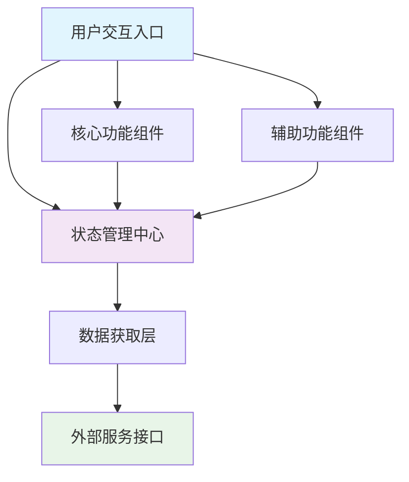
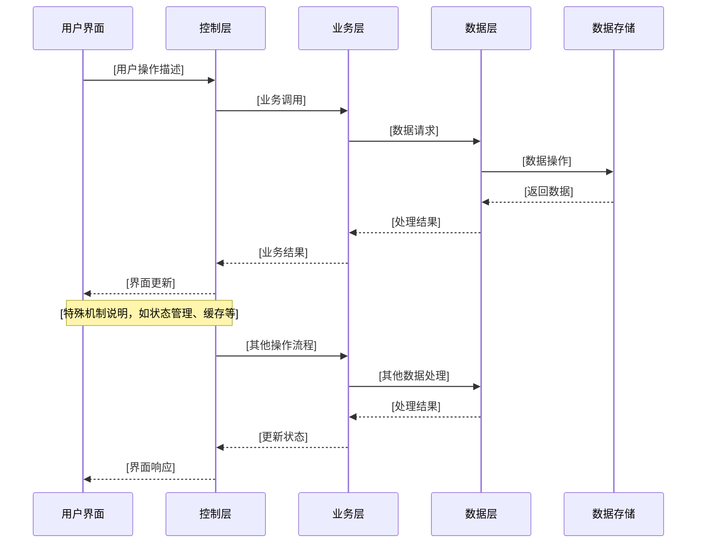

# [功能模块名称] - 技术架构文档

> 通用技术文档模板 - 适用于任何软件项目。本文档描述 [功能名称] 的技术实现细节、架构设计和数据流转。配合 [README.md](./README.md) 使用。

<!--
🎯 技术文档编写指南：
- 重点描述：核心架构、关键组件、数据流、重要接口
- 简略描述：工具函数、UI细节、常规操作
- 必须包含：Mermaid图表、架构分析、扩展指南
- 避免重复：README.md已有的功能描述
- 务实原则：聚焦已实现架构，避免性能优化建议和过度设计
- 实用导向：扩展指南要有具体步骤，不要空泛的建议
-->

## 🏗️ 架构概览

### 技术栈分层

> **思维指导**: 用分层思维分析你的功能架构。核心思想：
> - **职责分离**: 每层只关注特定职责，不跨层处理
> - **依赖方向**: 上层依赖下层，下层不知道上层存在
> - **抽象程度**: 越往上越接近用户，越往下越接近数据

```
┌─────────────────────────────────────────────┐
│  [用户交互层] - 直接面向用户的界面和交互      │
├─────────────────────────────────────────────┤
│  [控制逻辑层] - 协调用户操作和业务处理       │
├─────────────────────────────────────────────┤
│  [业务逻辑层] - 核心业务规则和流程处理       │
├─────────────────────────────────────────────┤
│  [数据访问层] - 统一的数据获取和存储接口     │
├─────────────────────────────────────────────┤
│  [数据存储层] - 实际的数据持久化和外部API    │
└─────────────────────────────────────────────┘
```

### 架构特点
- **[项目架构模式]**: [具体描述，如MVVM、MVP、MVC等]
- **[设计模式应用]**: [具体说明使用的设计模式]
- **[技术特色]**: [项目特有的技术实践]
- **[扩展性设计]**: [架构的可扩展性特点]

## 📦 核心组件架构

### 组件层次关系图



#### 🎯 核心组件职责

| 组件/类 | 文件路径 | 核心职责 | 关键依赖 |
|---------|---------|----------|----------|
| **[主页面/控制器]** | `[主要文件路径]` | [职责描述] | [依赖说明] |
| **[核心组件1]** | `[文件路径]` | [职责描述] | [依赖说明] |
| **[核心组件2]** | `[文件路径]` | [职责描述] | [依赖说明] |
| **[数据管理组件]** | `[文件路径]` | [职责描述] | [依赖说明] |
| **[业务逻辑组件]** | `[文件路径]` | [职责描述] | [依赖说明] |

### 架构模式体现

> **编写指导**: 展示项目中实际使用的架构模式，用真实代码片段说明。
> 可以是：核心组件的实际类定义、关键接口的真实签名、重要的依赖注入配置等。

```[实际语言]
[从代码中复制的真实架构模式实现片段]
```

## 🔄 数据流转分析

### 完整数据流程图



### 📊 关键数据转换

#### 数据模型映射

> **编写指导**: 如果存在数据转换，展示实际的输入和输出数据结构。
> 重点说明：数据在不同层之间是如何转换的，有什么字段映射关系。

```[实际语言]
[实际的数据转换代码片段或对比]
```

#### 数据转换逻辑
- **[转换器/适配器名称]**: `[文件路径]`
  - [转换职责描述]
  - [数据验证和处理说明]
  - [错误处理机制]

## 🔌 关键接口设计

### 主要接口定义

> **编写指导**: 贴出实际的接口定义代码。重点关注：
> - 对外暴露的关键接口（API路由、公共方法等）
> - 核心组件间的接口契约
> - 重要的回调或协议定义
>
> 直接从代码中复制，不要用占位符。

```[实际语言]
[从代码中复制的实际接口定义]
```

#### 🚀 核心实现示例

> **编写指导**: 展示关键接口的核心实现逻辑。选择1-2个最重要的实现，
> 重点说明业务逻辑和技术实现要点。

```[实际语言]
[实际的核心实现代码片段]
```

## 🎣 核心组件详解

### [核心组件名称] - [组件功能描述]

#### 🔧 组件架构

> **编写指导**: 说明这个组件的设计思路和关键实现点。重点关注：
> - 为什么要这样设计？
> - 解决了什么问题？
> - 有什么特殊的实现技巧？

#### 📦 内部实现机制

> **编写指导**: 用文字描述核心实现逻辑，配合必要的代码片段。
> 不要堆砌技术名词，重点解释"为什么这样做"。

#### 🔄 关键实现代码 (如有必要)

```[实际语言]
[关键的实现代码片段，重点突出核心逻辑]
```

## 🧪 测试说明

### 相关测试文件
- **单元测试**: `[测试文件路径]`
- **集成测试**: `[测试文件路径]`
- **UI测试**: `[测试文件路径]` (移动项目)
- **E2E测试**: `[测试文件路径]` (Web项目)

## 🔧 扩展开发指南

### [扩展场景1]
1. **[步骤1]**: [具体操作说明]
2. **[步骤2]**: [具体操作说明]
3. **[步骤3]**: [具体操作说明]
4. **[步骤4]**: [具体操作说明]

### [扩展场景2]
1. **[步骤1]**: [具体操作说明]
2. **[步骤2]**: [具体操作说明]
3. **[步骤3]**: [具体操作说明]
4. **[步骤4]**: [具体操作说明]

---

**提示**: 此技术文档与 [README.md](./README.md) 配合使用。README关注功能描述，本文档关注技术实现。

<!--
📝 编写完成后的检查清单：
- [ ] 架构概览是否清晰？
- [ ] Mermaid图表是否正确？(至少2个)
- [ ] 核心组件职责是否明确？
- [ ] 数据流转是否完整？
- [ ] 接口设计是否展示真实代码？
- [ ] 核心组件是否详细说明？
- [ ] 扩展指南是否有具体步骤？
- [ ] 避免了性能优化建议和过度设计？
- [ ] 聚焦已实现架构而非理论建议？
-->