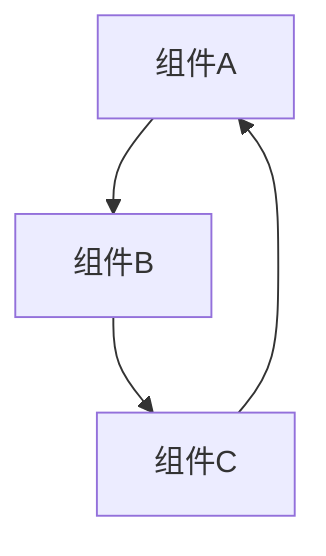
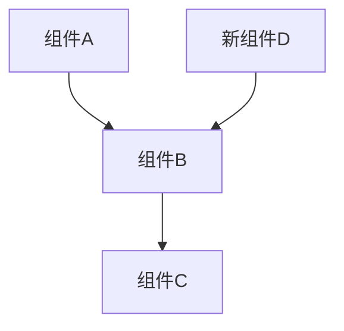

# 模块重构计划 - [模块名] - [日期]

## 现状分析

### 当前文件列表及职责
| 文件 | 当前职责 | 行数 | 问题 |
|------|----------|------|------|
| file1.ts | ... | 200 | 职责不清/过长/... |
| file2.ts | ... | 150 | ... |

### 存在的问题

#### 职责问题
- 类A职责模糊，同时处理X和Y
- 类B和类C功能重复

#### 依赖问题
- 循环依赖：A → B → C → A
- 过度耦合：...

#### 数据流问题
- 数据流转路径不清晰
- 状态管理混乱

### 当前数据流图

## 目标架构

### 优化后的类职责表
| 文件 | 新职责 | 预计行数 | 改进点 |
|------|--------|----------|--------|
| file1.ts | 清晰的职责1 | 150 | 拆分/简化 |
| file2.ts | 清晰的职责2 | 100 | 职责聚焦 |
| file3.ts | 新增：职责3 | 80 | 从file1拆分 |

### 目标数据流图

### 文件重组方案
- **拆分**: file1.ts → file1.ts + file3.ts
- **合并**: file2.ts + file4.ts → file2.ts
- **重命名**: oldName.ts → newName.ts
- **删除**: obsoleteFile.ts

## 执行步骤

### 阶段1: 基础重构（预计X小时）
- [ ] 步骤1.1 - 具体操作
- [ ] 步骤1.2 - 具体操作
- **验证**: 运行测试确保功能不变
- **风险**: 可能的风险点

### 阶段2: 结构调整（预计X小时）
- [ ] 步骤2.1 - 具体操作
- [ ] 步骤2.2 - 具体操作
- **验证**: 检查依赖关系是否优化
- **风险**: 可能的风险点

### 阶段3: 优化清理（预计X小时）
- [ ] 步骤3.1 - 具体操作
- [ ] 步骤3.2 - 具体操作
- **验证**: 最终验证
- **风险**: 可能的风险点

## 文档更新清单
- [ ] TECHNICAL.md - 组件职责表
- [ ] TECHNICAL.md - 数据流转图
- [ ] TECHNICAL.md - 模块架构说明
- [ ] README.md - 相关功能说明（如有影响）

## 执行记录

### 实际执行情况
（计划审查通过后，在此记录实际执行过程）

### 遇到的问题和解决方案
（记录实施过程中的问题和解决思路）

### 最终总结
（完成后总结实际效果和经验教训）
