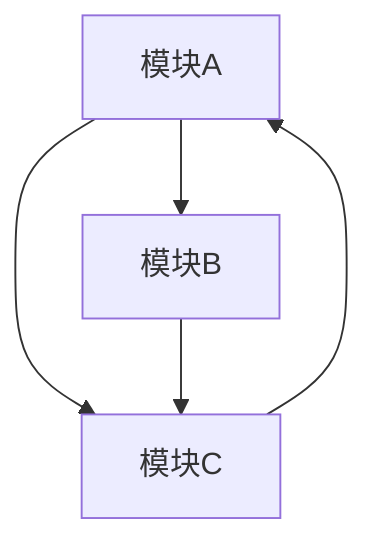
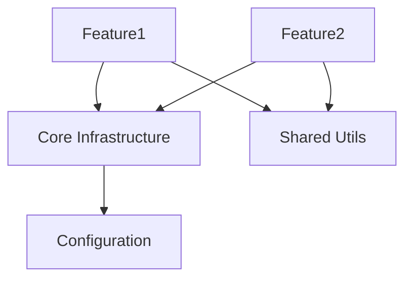
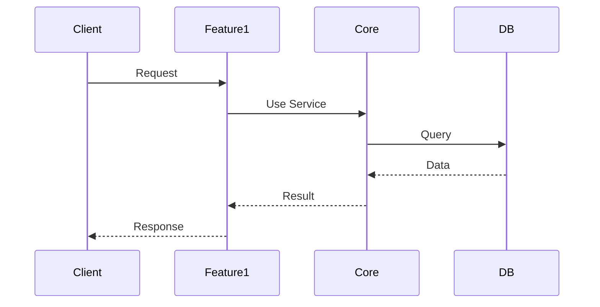

# 项目重构计划 - [项目名] - [日期]

## 现状评估

### 当前项目结构
```
project/
├── src/
│   ├── module1/
│   ├── module2/
│   └── ...
├── tests/
└── docs/
```

### 模块划分和职责表
| 模块 | 职责 | 文件数 | 代码量 | 问题 |
|------|------|--------|--------|------|
| module1 | ... | 10 | 2000行 | 职责混乱 |
| module2 | ... | 5 | 800行 | 依赖过重 |

### 核心问题总结

#### 架构问题
- 模块边界不清晰
- 跨模块依赖混乱
- 缺少统一的基础设施

#### 技术债务
- 过时的依赖包
- 重复的代码逻辑
- 缺失的错误处理

#### 基础设施问题
- 配置管理混乱
- 日志系统不统一
- 缺少统一的错误处理机制

### 当前架构图


## 目标架构

### 架构原则
1. **清晰的模块边界**: 每个模块职责单一
2. **单向依赖流动**: 避免循环依赖
3. **统一的基础设施**: 配置、日志、错误处理统一
4. **可测试性**: 模块间接口清晰便于测试
5. **可扩展性**: 新功能易于添加

### 新模块结构和依赖关系
```
project/
├── src/
│   ├── core/          # 核心基础设施
│   ├── modules/
│   │   ├── feature1/  # 业务模块1
│   │   └── feature2/  # 业务模块2
│   ├── shared/        # 共享工具
│   └── config/        # 配置管理
├── tests/
└── docs/
```

### 目标架构图


### 跨模块数据流图


## 执行路线图

### 阶段1: 基础设施重构（预计X天）
**目标**: 建立统一的基础设施层

- [ ] 统一配置管理系统
- [ ] 统一日志系统
- [ ] 统一错误处理机制
- [ ] 建立核心工具库

**验证标准**:
- 所有模块使用统一的配置/日志/错误处理
- 基础设施测试通过

**风险**:
- 可能影响现有功能
- 回滚方案：保留旧代码，通过开关切换

### 阶段2: 模块拆分重组（预计X天）
**目标**: 优化模块划分和依赖关系

- [ ] 拆分职责混乱的模块
- [ ] 消除循环依赖
- [ ] 重组目录结构
- [ ] 更新导入路径

**验证标准**:
- 模块职责清晰
- 无循环依赖
- 所有测试通过

**风险**:
- 大量文件移动可能导致错误
- 回滚方案：Git分阶段提交，每阶段独立可回滚

### 阶段3: 技术栈升级（预计X天，可选）
**目标**: 升级过时依赖和技术栈

- [ ] 升级核心依赖包
- [ ] 迁移废弃API
- [ ] 更新配置文件

**验证标准**:
- 所有依赖更新到稳定版本
- 功能测试全部通过

**风险**:
- 破坏性变更
- 回滚方案：锁定旧版本，分步升级

### 阶段4: 优化清理（预计X天）
**目标**: 清理技术债务，优化性能

- [ ] 删除废弃代码
- [ ] 消除重复逻辑
- [ ] 性能优化
- [ ] 代码规范统一

**验证标准**:
- 代码覆盖率达标
- 性能指标提升
- 代码规范检查通过

**风险**:
- 较低
- 回滚方案：保留备份

## 文档更新计划
- [ ] README.md - 项目结构和快速开始
- [ ] TECHNICAL.md - 架构设计和技术选型
- [ ] CLAUDE.md - AI助手操作指南更新
- [ ] docs/ADR/ - 重大架构决策记录（ADR）

## 执行记录

### 实际执行时间线
（计划审查通过后，记录每个阶段的实际开始和完成时间）

| 阶段 | 计划开始 | 实际开始 | 计划完成 | 实际完成 | 状态 |
|------|----------|----------|----------|----------|------|
| 阶段1 | ... | ... | ... | ... | ... |
| 阶段2 | ... | ... | ... | ... | ... |

### 遇到的问题和解决方案
（记录重构过程中的重要问题和决策）

### 最终总结
（完成后总结）
- 实际效果
- 经验教训
- 后续建议
